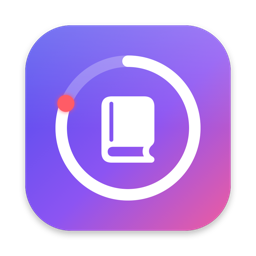
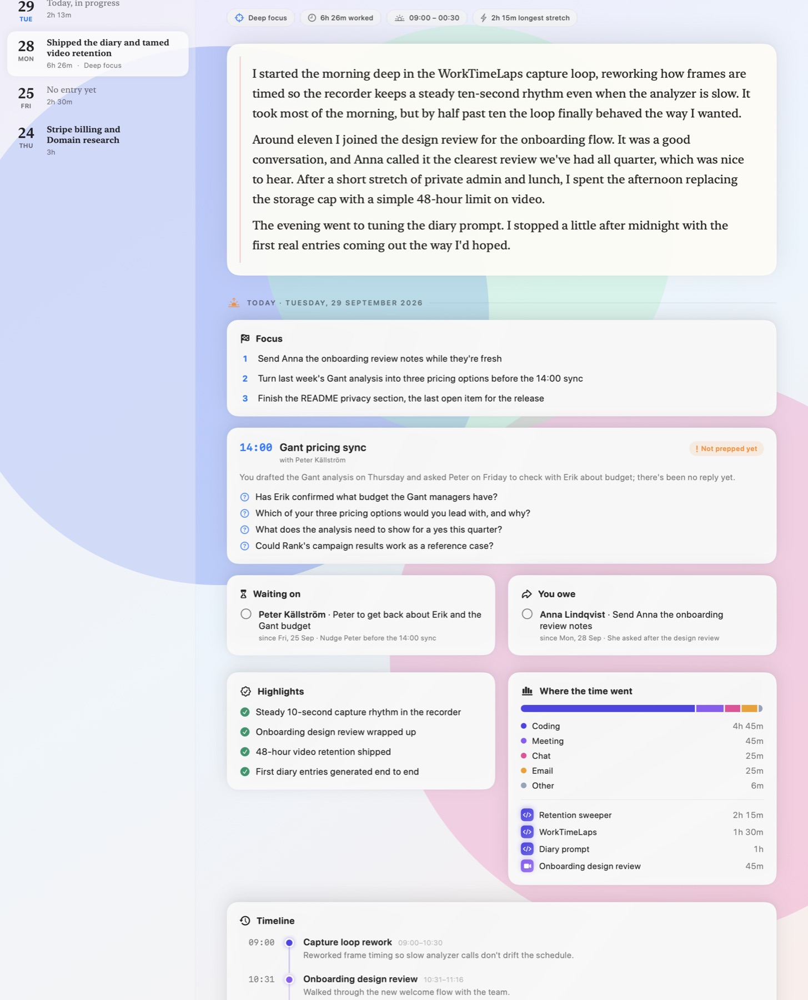
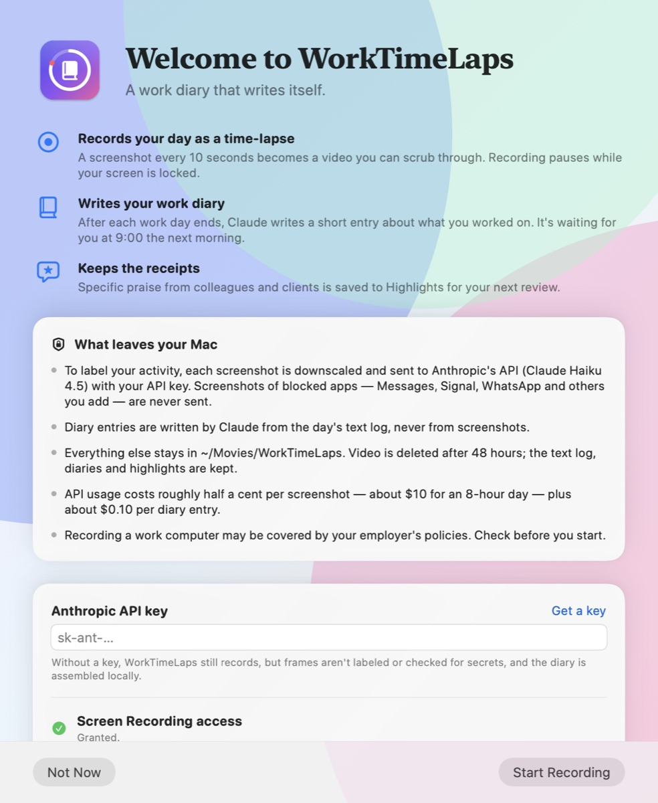

<p align="center">
  
</p>

<h1 align="center">WorkTimeLaps</h1>

<p align="center">
  A macOS menu-bar app that turns your work day into a time-lapse — and a work diary that writes itself.
</p>

<p align="center">
  <a href="https://github.com/NiklasPromtech/WorkTimeLaps/actions/workflows/build.yml"></a>
  
  <a href="LICENSE"></a>
</p>

<p align="center">
  
</p>

WorkTimeLaps takes a screenshot every minute while you work. Claude labels each one — what app, what task, how focused — and the frames become a video you can scrub through. After each work day ends, Claude turns the day's activity log into a short diary entry, and at 9:00 the next morning a notification tells you it's ready.

It's built for the question you can never answer on a Friday afternoon, or at review time: *what did I actually do?*

## Features

- **Work Diary.** A page for every day you worked: a headline, a short first-person account, highlights, a timeline, where the time went, praise you received, and loose ends to pick up. Written by Claude from the day's text log (never from screenshots), or assembled locally if you'd rather not use the API for it. Every entry is also saved as Markdown.
- **Always on, but not always recording.** Opens at login and starts recording by itself. Pauses automatically while your screen is locked, the display or Mac is asleep, or you pause it from the menu (15 minutes, an hour, or until tomorrow).
- **Work days that match how you work.** A day runs from 02:00 to 02:00 by default, so a late night counts toward the day it started. The cutoff is configurable.
- **Time-lapse video.** A whole work day plays back in under a minute. Screenshots are taken once a minute by default (10 seconds to 2 minutes in Settings). Videos are kept for 48 hours, then deleted automatically — the text log, journal, diaries and highlights are kept.
- **Journal.** A week view of time worked per day, and per-session playback with an engagement curve, a category breakdown and a live activity stream.
- **Highlights.** Specific praise from colleagues and clients ("the analysis you ran saved us a week") is picked up from Slack, email and PR comments and kept for your next review. A strict rubric keeps routine "thanks!" out.
- **Privacy controls.** Block apps and window titles outright, redact financial, medical, HR/legal and personal-message content from the video, and redact any frame that shows a password, API key or other secret.

<p align="center">
  
</p>

## What leaves your Mac

WorkTimeLaps has no server and no telemetry. The only network requests it makes go to the Anthropic API, using your own API key:

| What | Sent to | When |
|---|---|---|
| Each screenshot, downscaled to 1568 px and JPEG-compressed | Claude Haiku 4.5 | Once a minute while recording (configurable) — **except** frames of blocked apps and windows, WorkTimeLaps' own windows, and anything captured while paused or locked |
| The day's text log: activity labels, one-line summaries, times, praise quotes and your session notes | Claude Opus 5.5 | Once per work day, to write the diary |

Worth knowing:

- **To catch a secret, Claude has to see it.** Frames that show a password or API key are sent for analysis like any other frame; redaction protects the saved video, the log, and anything you share from them. If something must never leave your Mac, add the app or window title to the block list — those frames are never sent.
- **Private stays private in the diary.** Frames redacted by a privacy filter or block rule appear in the diary prompt only as "private time", with no labels.
- **Without an API key** the app still records and keeps a journal, but frames aren't labeled or checked for secrets, and diaries are assembled locally from the numbers.
- The API key is stored in your macOS keychain.
- Recording a work computer may be covered by your employer's policies or local law. Check before you start.

## What it costs

You pay Anthropic directly for API usage. Estimates at current list prices:

| | Tokens per call | Cost |
|---|---|---|
| One screenshot (Claude Haiku 4.5, $1 / $5 per million input / output tokens) | ~1,600 image + ~2,300 prompt in, ~150 out | ~$0.004–0.005 |
| An 8-hour day at one screenshot a minute (480 screenshots) | | **~$2** |
| An 8-hour day at one every 10 seconds (2,880 screenshots) | | ~$13 |
| One diary entry (Claude Opus 5.5, $4 / $20 per million) | ~5–10k in, ~2–4k out | ~$0.10 |

Idle time is cheaper than it looks: nothing is sent while the screen is locked or the Mac sleeps, and blocked apps are never sent. Check the [Anthropic Console](https://console.anthropic.com/) for your actual usage.

## Requirements

- macOS 14 Sonoma or newer
- Xcode Command Line Tools (`xcode-select --install`)
- An [Anthropic API key](https://console.anthropic.com/settings/keys) (optional, but most features need it)

## Install

```bash
git clone https://github.com/NiklasPromtech/WorkTimeLaps.git
cd WorkTimeLaps
./build.sh install
open /Applications/WorkTimeLaps.app
```

`./build.sh` alone builds `WorkTimeLaps.app` in the project folder; `install` also copies it to `/Applications`, which keeps the login item pointing at the right place.

On first launch a welcome window walks you through the API key, Screen Recording access and the login item. Recording starts when you click **Start Recording**.

**Signing and permissions.** macOS ties Screen Recording access, and access to the app's keychain item, to the app's signing identity. `build.sh` signs with your Apple Development certificate when you have one, so permissions survive rebuilds. It's free: in Xcode, open **Settings → Accounts**, add your Apple ID, then **Manage Certificates… → + → Apple Development**. Without one it signs ad hoc, and every rebuild looks like a new app to macOS:

- The old Screen Recording entry stays switched on but no longer applies. Select WorkTimeLaps in **System Settings → Privacy & Security → Screen & System Audio Recording**, remove it with **–**, and grant access again (or run `tccutil reset ScreenCapture com.niklas.worktimelaps`).
- macOS may ask whether WorkTimeLaps can read its keychain item. Choose **Always Allow**.

To pick a specific identity, run `CODESIGN_IDENTITY="Apple Development: …" ./build.sh`; `CODESIGN_IDENTITY=- ./build.sh` forces ad-hoc signing.

Once access is granted, recording starts on its own; if it doesn't, choose **Quit & Reopen WorkTimeLaps** from the menu. macOS also re-confirms from time to time that you still want to allow screen recording.

## Using it

The ◉ icon in the menu bar fills in while recording, with a live engagement number (grey, blue, orange, red — an effort tachometer, not a productivity score). The shortcuts below work while the menu is open.

- **Stop / Start Recording**, and **Pause** for 15 minutes, an hour, or until tomorrow.
- **Latest Diary…** (⌘D) opens the Diary on the most recent finished day. Days from the last three days get an entry automatically; for older days, click **Write it now**. **Rewrite** asks Claude for a fresh take; **Copy** puts the Markdown on the clipboard.
- **Journal…** (⌘J) shows the week, each day's sessions, and per-session playback.
- **Highlights…** (⌘H) collects the praise you've received over 7, 30 or 90 days, or the year.
- **Settings…** (⌘,) has the login item, how often to take a screenshot, video retention, the day cutoff, the diary notification time, the API key, privacy filters and the block list.

## Where things are stored

Everything lives in `~/Movies/WorkTimeLaps` (or `$WORKTIMELAPS_DATA_DIR`, if set):

```
~/Movies/WorkTimeLaps/
├── TimeLapse_2026-09-29_09-00-00.mp4        video — deleted after 48 hours
├── TimeLapse_2026-09-29_09-00-00.thumb.jpg  thumbnail — deleted with the video
├── TimeLapse_2026-09-29_09-00-00.json       frame log — kept
└── _journal/                                kept
    ├── 2026-09-29.json                      the work day's sessions
    ├── recognitions.json                    highlights
    ├── activities.json                      rolling 2-hour activity vocabulary
    └── diary/
        ├── 2026-09-29.json
        └── 2026-09-29.md
```

One session is recorded per work day (a new one starts at the cutoff, or whenever you stop and start again). Videos use movie fragments, so a crash or power cut loses at most the last few minutes, and unfinished sessions are closed out on the next launch.

## How it works

Once a minute (by default) the recorder checks the front app and window against the block list. Anything else is sent to Claude Haiku in a single call that returns a JSON verdict: whether a secret is visible, a category (coding, writing, email, chat, meeting, browsing, design, terminal, reading, media, other), a specific activity label ("Stripe pricing config", reused across frames through a rolling vocabulary so the stream clusters cleanly), a one-line summary, an engagement score, a privacy tag, and — only when the rubric's bar is met — a quote of praise addressed to you. The frame, or a REDACTED placeholder, is appended to the day's H.264 video; the verdict goes into the frame log. If the call fails, the frame is redacted (fail-closed).

When a work day ends, the diary scheduler condenses that day's frame logs into a timeline of activity blocks, adds totals, praise and your session notes, and asks Claude Opus 5.5 for a structured entry (JSON schema output, streamed, with server-side fallback to another model if the request is declined). It retries with back-off if the API is unavailable, saves a local entry in the meantime, and schedules the morning notification.

## Development

```
Sources/
├── main.swift, AppDelegate.swift      app bootstrap, notifications, first run
├── MenuBarController.swift            status item, menu, recording control
├── TimeLapseRecorder.swift            capture loop, redaction, video writer, sessions
├── SystemStateMonitor.swift           lock / sleep / display state → pause
├── FrameAnalyzer.swift                per-frame Claude Haiku call
├── FrameAnalysis.swift                categories, privacy tags, analysis result
├── ActivityVocabulary.swift           rolling 2-hour activity label list
├── ActivityTimeline.swift             frames → activity blocks and active time
├── WorkDay.swift                      the 02:00 → 02:00 work-day boundary
├── RecordingSession.swift             frame log (sidecar JSON)
├── Journal.swift                      day logs + crash recovery
├── JournalStore.swift, JournalWindow.swift       Journal window
├── Recognition.swift, HighlightsWindow.swift     Highlights
├── Diary.swift                        diary model, storage, Markdown export
├── DiaryComposer.swift                a day's stats, prompt text, local entries
├── DiaryWriter.swift                  Claude Opus call (streaming, JSON schema)
├── DiaryScheduler.swift               automatic diaries, notifications, retention
├── DiaryWindow.swift                  Diary window
├── WelcomeWindow.swift, SettingsWindow.swift
├── PrivacyFilterStore.swift, PrivacyRulesStore.swift, WorkContextProbe.swift
├── RetentionSweeper.swift, APIKeyStore.swift, APIKeyPrompt.swift, LoginItem.swift
└── Preferences.swift, Storage.swift, RedactedFrame.swift, VideoEncoder.swift
```

There's no Xcode project: `build.sh` compiles everything with `swiftc`. To work in Xcode, create a macOS App target, add the files under `Sources/`, and use `Resources/Info.plist`.

```bash
./build.sh               # build WorkTimeLaps.app
./scripts/test.sh        # run the tests (uses a temporary data folder)
swift scripts/make-icon.swift   # regenerate Resources/AppIcon.icns
```

Handy while developing: `open --env WORKTIMELAPS_DATA_DIR=/tmp/wtl WorkTimeLaps.app` keeps test recordings out of `~/Movies`. Tuning knobs (playback rate, bitrate) are at the top of `TimeLapseRecorder.swift`.

## Limitations

- Records the main display only.
- Built from source and not notarized — see the signing notes above.
- Frame labels come from a model looking at screenshots, so they're sometimes vague or wrong. The diary is told to trust patterns over single frames, but read it as a draft of your day, not a record.

## Contributing

Issues and pull requests are welcome. Please run `./scripts/test.sh` before opening a pull request; CI runs the same build and tests on every push.

## License

[MIT](LICENSE). Not affiliated with or endorsed by Anthropic.
